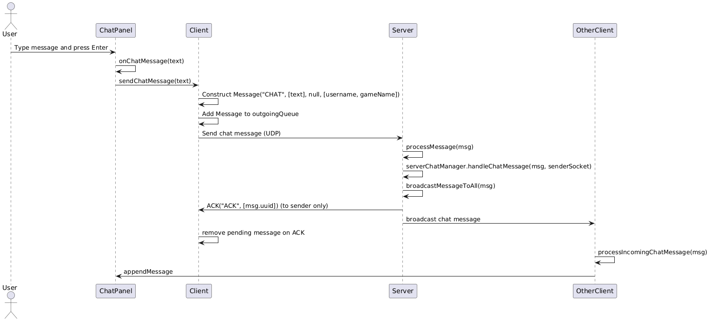

# Technical Documentation – Chat Feature

## 1. Overview

The chat feature is integrated into the existing client–server messaging system. It leverages the same infrastructure used for player movement, nickname changes, etc. The chat functionality is enabled by introducing a new message type `"CHAT"`. When a user sends a message, the client wraps the text into a `Message` object, places it on the outgoing message queue, and the server broadcasts it to all connected clients. Additionally, the server acknowledges the chat message to the sender so that the client’s reliable UDP layer does not keep retransmitting it. On the receiving side, each client intercepts `"CHAT"` messages and displays them on a dedicated chat panel integrated into the Swing UI.

## 2. Design Components

### 2.1. Message

**Purpose:**  
Encapsulate all communication in a standardized format.

**Usage:**
- The `Message` class is reused to create chat messages (with the type `"CHAT"`).
- The chat text is stored in the `parameters` array, and the sender’s name is included in the `concealedParameters`.
- Each `Message` also has a UUID, which is used by the reliable UDP system to track acknowledgments.

### 2.2. ChatPanel

**Purpose:**  
Provide a user interface for chat.

**Components:**
- **JTextPane (or JTextArea):** Displays the chat history (read-only).
- **JTextField:** Accepts user input. When the user presses Enter, the text is sent.
- A typing indicator label is also included, which can be used to show “is typing...” messages.

**Integration:**
- A listener (defined via a simple functional interface, `ChatPanelListener`) is used to pass chat messages from the panel to the `ClientChatManager`.

### 2.3. ChatManager

**ClientChatManager:**
- Wraps the `ChatPanel` UI and handles local chat logic.
- When a user sends text, it creates a `"CHAT"` message and places it in the client’s outgoing queue.
- When a `"CHAT"` message arrives from the server, it appends the text to the chat panel.

**ServerChatManager:**
- Handles incoming `"CHAT"` messages on the server side.
- Broadcasts each chat message to all connected clients, including the sender.
- Immediately sends an `"ACK"` back to the sender to stop repeated retransmissions.

### 2.4. Client

**Purpose:**  
Manages game state, user input, and outgoing/incoming messages.

**Integration:**
- The client creates a `ChatManager.ClientChatManager` and obtains the `ChatPanel` from it.
- The client includes a UI toggle (using `ChatUIHelper`) so the user can “Open Chat” or “Close Chat,” controlling whether the chat panel is visible.
- Outgoing chat messages are placed in the client’s `outgoingQueue`, and incoming `"CHAT"` messages are forwarded to the `ClientChatManager` for display.

### 2.5. Server

**Purpose:**  
Receives UDP packets from clients, decodes messages, and broadcasts them to all other clients.

**Usage:**
- When the server receives a `"CHAT"` message, it calls `serverChatManager.handleChatMessage(...)`.
- The `ServerChatManager` calls `broadcastMessageToAll(msg)` so that all clients (including the sender) see the message.
- The server then sends an `"ACK"` message to the original sender’s socket, ensuring the sender’s reliable UDP stops retransmitting.

---

## 3. Diagrams
### 3.1. Class Diagram
The following diagram shows the main classes involved in the chat feature and their relationships.

- **Message**
    - **Purpose:**  
      Encapsulates all messages exchanged between clients and the server. It includes the message type (e.g., `"CHAT"`), parameters (such as the chat text), an optional field, and concealed parameters (e.g., the sender’s name).
    - **Why:**  
      A uniform message format simplifies the encoding, decoding, and routing of various types of messages (movement, nickname updates, chat, etc.) using the same infrastructure.

- **ChatPanel**
    - **Purpose:**  
      Provides the UI for chat interactions. It includes:
        - A **JTextArea** for displaying the chat history (read-only).
        - A **JTextField** for entering new messages.
    - **Why:**  
      Integrating chat into the game’s main window gives users an intuitive and seamless interface to communicate without leaving the game screen.

- **ChatMessageListener (Interface)**
    - **Purpose:**  
      Defines a callback method `onChatMessage(String message)` that the ChatPanel uses to inform the Client when a new chat message is submitted.
    - **Why:**  
      Using a listener interface decouples the ChatPanel from the Client logic, resulting in a more modular and easily maintainable system.

- **Client**
    - **Purpose:**  
      Manages the game state, user inputs, and the queues for outgoing and incoming messages. It integrates the ChatPanel into the overall UI and processes outgoing chat messages by creating a `Message` object.
    - **Why:**  
      Centralizing the handling of messages (including chat) ensures consistency across all connected clients and maintains an organized flow of information.

- **Server**
    - **Purpose:**  
      Receives UDP packets from clients, decodes them, and broadcasts the messages (including chat messages) to all connected clients.
    - **Why:**  
      Acting as the relay station, the Server ensures that every chat message is distributed to all players, thereby synchronizing communication across the network.

### 2.2 Sequence Diagram

This sequence diagram details the flow of a chat message from when the user types it to when it is displayed on other clients:

1. **User Interaction**  
   The user types a message in the `ChatPanel` and presses Enter.

2. **Triggering the Callback**  
   The `ChatPanel` fires the `onChatMessage` callback, passing the entered text to the `Client`.

3. **Message Construction**  
   The `Client` creates a `Message` object with type **"CHAT"**, placing the chat text in the parameters and the sender’s name in the concealed parameters.

4. **Sending the Message**  
   The message is added to the outgoing queue, and a sender task transmits it to the `Server` via UDP.

5. **Server Processing**  
   The `Server` receives, decodes, and then broadcasts the message to all connected clients.

6. **Reception on Other Clients**  
   Each client processes the incoming **"CHAT"** message and passes it to its `ChatPanel`.

7. **Displaying the Message**  
   The `ChatPanel` appends the new message to its chat history.

### 2.3 Activity Diagram

The activity diagram below provides a high-level overview of the entire process for sending and receiving a chat message:

1. **User Input**  
   The user enters a chat message in the `ChatPanel`.

2. **Message Submission**  
   Upon pressing Enter, the `ChatPanel` triggers the `onChatMessage` callback.

3. **Message Creation**  
   The `Client` constructs a `Message` object of type **"CHAT"**.

4. **Queueing the Message**  
   The message is added to the outgoing queue.

5. **Sending the Message**  
   A sender task transmits the message to the `Server` via UDP.

6. **Server Broadcast**  
   The `Server` receives and decodes the message, then broadcasts it to all clients.

7. **Message Reception**  
   Each client receives the message via its receiver task.

8. **Message Processing**  
   The `Client` processes the message and forwards it to its `ChatPanel`.

9. **Display**  
   The `ChatPanel` appends the message to the chat history, making it visible to the user.

---

Plant UML Code:
### Class UML Diagram
@startuml
' -------------------------------
' Message and Chat UI Components
' -------------------------------

class Message {
- String messageType
- Object[] parameters
- String option
- String[] concealedParameters
- String uuid
+ String getMessageType()
+ Object[] getParameters()
+ String getOption()
+ String[] getConcealedParameters()
+ String getUUID()
+ void setUUID(String)
  }

class ChatPanel {
- JTextPane chatPane
- JTextField inputField
- StyledDocument doc
- SimpleAttributeSet redStyle
- SimpleAttributeSet blackStyle
- ChatPanelListener listener
- JLabel typingIndicatorLabel
+ ChatPanel(ChatPanelListener listener)
+ void appendMessage(String message, boolean isLocal)
+ void showTypingIndicator(String sender)
+ void clearTypingIndicator()
  }

interface ChatPanelListener {
+ void onChatMessage(String message)
+ void onTyping()
  }

class ChatUIHelper {
+ static void installChatUI(JFrame frame, JPanel chatPanel)
  }

' -------------------------------
' Chat Manager and Nested Classes
' -------------------------------

package "ChatManager" {
class ClientChatManager {
- ChatPanel chatPanel
- String username
- String gameName
- ConcurrentLinkedQueue<Message> outgoingQueue
+ ClientChatManager(String username, String gameName, ConcurrentLinkedQueue<Message> outgoingQueue)
+ ChatPanel getChatPanel()
+ void sendChatMessage(String text)
+ void processIncomingChatMessage(Message msg)
  }

class ServerChatManager {
- Server server
+ ServerChatManager(Server server)
+ void handleChatMessage(Message msg, InetSocketAddress senderSocket)
  }
  }

' -------------------------------
' Client and Server
' -------------------------------

class Client {
- ConcurrentLinkedQueue<Message> outgoingQueue
- ConcurrentLinkedQueue<Message> incomingQueue
- ChatManager.ClientChatManager clientChatManager
+ void run()
+ void startGraphicsStuff(String clientName)
+ void processServerResponse(Message msg)
  }

class Server {
- ConcurrentHashMap<String, InetSocketAddress> clientsMap
- DatagramSocket serverSocket
- ReliableUDPSender reliableSender
- AckProcessor ackProcessor
- Game MyGameInstance
- ConcurrentLinkedQueue<OutgoingMessage> outgoingQueue
- ChatManager.ServerChatManager serverChatManager
+ void start()
+ void processMessage(Message msg, InetSocketAddress senderSocket)
+ void broadcastMessageToAll(Message msg)
+ void broadcastMessageToOthers(Message msg, String excludedUsername)
  }

' OutgoingMessage as an inner helper class in Server
class OutgoingMessage {
- Message msg
- InetAddress address
- int port
+ OutgoingMessage(Message msg, InetAddress address, int port)
  }

' -------------------------------
' Relationships
' -------------------------------

Client --> ClientChatManager : uses
Client --> Message : sends/receives
Server --> Message : broadcasts
ChatPanel ..> ChatPanelListener : uses
ClientChatManager --> ChatPanel : aggregates
ServerChatManager --> Server : uses
ChatUIHelper ..> ChatPanel : installs
Server ..> OutgoingMessage : creates

@enduml

### Sequence UMl
@startuml
actor User
participant ChatPanel
participant Client
participant Server
participant OtherClient

User -> ChatPanel: Type message and press Enter
ChatPanel -> ChatPanel: onChatMessage(text)
ChatPanel -> Client: sendChatMessage(text)
Client -> Client: Construct Message("CHAT", [text], null, [username, gameName])
Client -> Client: Add Message to outgoingQueue
Client -> Server: Send chat message (UDP)

Server -> Server: processMessage(msg)
Server -> Server: serverChatManager.handleChatMessage(msg, senderSocket)
Server -> Server: broadcastMessageToAll(msg)
Server -> Client: ACK("ACK", [msg.uuid]) (to sender only)
Server -> OtherClient: broadcast chat message

Client -> Client: remove pending message on ACK
OtherClient -> OtherClient: processIncomingChatMessage(msg)
OtherClient -> ChatPanel: appendMessage
@enduml

### Activity UML
@startuml
start
:User types chat message;
:ChatPanel triggers onChatMessage;
:Client constructs "CHAT" Message;
:Client places Message on outgoingQueue;
:Sender Task sends the Message via UDP;

:Server receives Message;
:Server calls ServerChatManager.handleChatMessage;
:Server broadcasts the Message to all clients;
:Server sends ACK to original sender;

:Client receives ACK;
:Client stops retransmitting;
:All clients receive "CHAT" message from server;
:Each client calls processIncomingChatMessage;
:ChatPanel appends the message to chat history;
stop
@enduml
