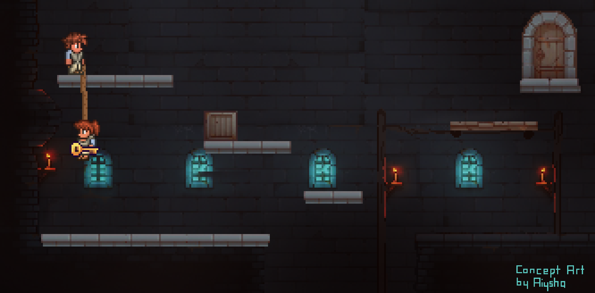

# Think Outside the Room: A Cooperative Multiplayer Escape Room Platformer

## Introduction

"Think Outside the Room" is a 2D pixel art multiplayer platformer that combines classic escape room puzzles. In this game two characters share the spotlight on screen, while two player control a single character. This design creates an engaging asymmetrical gameplay experience wh ere coordination is the key to success.

## Game Theme

Set within a confined, puzzle-laden room:
- **The Escaper:** Must navigate the single room filled with obstacles and puzzles to reach the exit.

## Gameplay Mechanics

### Characters and Roles

**Escaper:**
- **Control:** A single character that is controlled collaboratively by two players.
- **Player Responsibilities:**
    - **Walking:** Player one is dedicated to steering the Escaper.
    - **Jumping:** Player two handles the jump commands.
    - **Grabbing:** Player one is responsible for grabbing items.
    - **Throwing:** Player two is responsible for throwing items.
- **Objective:** Work together to navigate through the obstacles in the room and reach the exit.
- **Cooperation:** The four players must coordinate their inputs precisely to successfully guide the Escaper to safety.

### Level Design and Objectives

- **Single Level:** The game consists of one level—a single room that the Escapers must escape.
- **Dynamic Obstacles:** The room is designed like a platform-stage with moving platforms, traps, and puzzles that challenge the coordinated actions of the Escaper team.
- **Exit Goal:** The Escaper must reach the designated exit point to successfully complete the level.
- **Challenge and Balance:** The room’s layout is carefully balanced to reward teamwork and precision.
- **Items:** 
- **Key:** A key must be obtained to unlock the exit.
- **Rope:** A rope can be used to dangle another character off a platform. 
  One character holds the rope while standing on a platform, and the other character holds onto the rope while hanging off the platform to retrieve the key or interact with specific elements in the level.
- **Flashlight:** A flashlight can be used to illuminate dark areas of the room. Some puzzles require flashlight to active some specific mechanism.

## Networking and Architecture

Think Outside the Room utilizes a client/server architecture with a custom text-based network protocol:

- **Server Responsibilities:**
    - Manage the global game state, including player positions, collisions, and interactions within the single room.
    - Handle the game session and process commands (e.g., MOVE, JUMP, HOLD) using a custom, easily debuggable protocol.
    - Enforce game rules such as win/lose conditions—determining if the Escaper escapes or is caught by the Hunter.

- **Client Responsibilities:**
    - Provide a graphical user interface (GUI) for capturing player inputs and displaying the game state.
    - Send user commands to the server and receive real-time updates to maintain synchronization across all players.
    - Include chat and lobby functionality for pre-game organization and communication during gameplay.

- **Network Protocol:**
    - Communication is based on a self-designed, text-based protocol that supports clear, debuggable exchanges between the server and clients.

## Unique Selling Points

- **Asymmetrical Control:** Two players must work together, utilizing unique cooperative mechanics like standing on each other and lifting.
- **High-Stakes Chase:** The single-level design creates an intense, puzzle-filled challenge that requires precise coordination.
- **Dynamic Platforming in a Single Room:** Despite being confined to one room, the level is packed with diverse obstacles and puzzles that demand precise coordination.
- **Retro Aesthetics:** Charming 2D pixel art visuals deliver nostalgic appeal combined with modern multiplayer features.
- **Robust Networking:** The custom client/server architecture ensures smooth, synchronized gameplay and effective communication.
